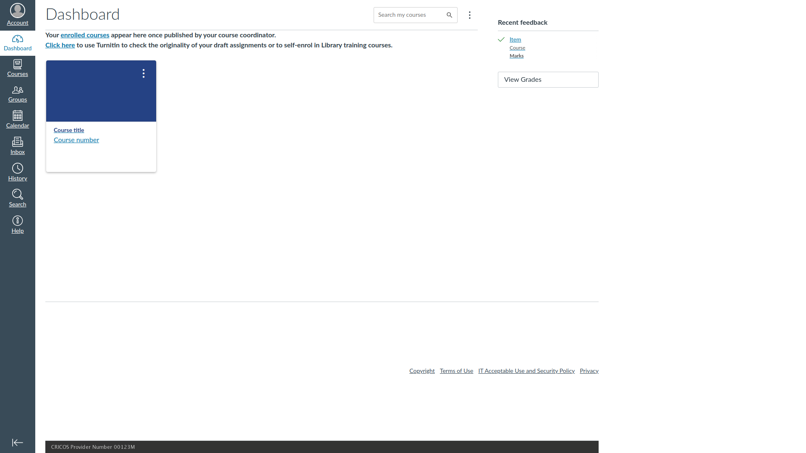
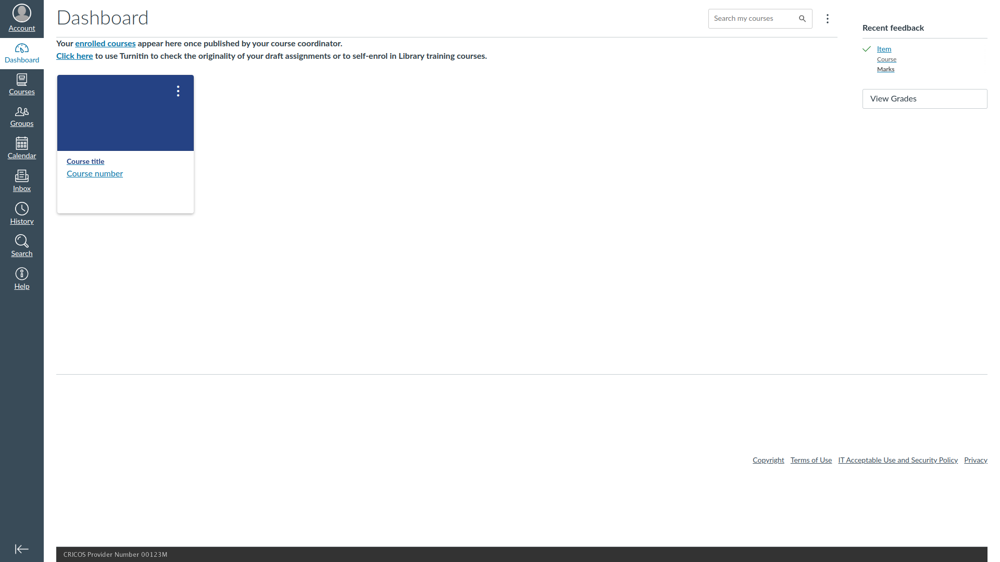

# MESS

MyUni Excess Space Shrinker

MyUni (Canvas LMS of The University of Adelaide) has too much unnecessary white space on the right. This eliminates that. 

Features:
* Eliminate the unnecessary white space
* Prevent overflowing course name in to-do list

## Demonstration

Before:



After:



## Usage

### Chrome

Download the latest `MESS.[semver].chrome.zip` file from the [releases page](https://github.com/tinnamchoi/MESS/releases). 

Go to `chrome://extensions/` and click "Load unpacked".

Select the unpacked folder.

### Firefox

Download the latest `MESS.[semver].firefox.xpi` file from the [releases page](https://github.com/tinnamchoi/MESS/releases). 

Go to `about:addons` and click on the gear icon next to "Manage Your Extensions". Click "Install Add-on From File...".

Select the downloaded file.

Go to a MyUni page. Click on the extensions icon (shaped like a jigsaw puzzle piece) in the top-right corner. Click the gear next to "MESS" and select "Always Allow on myuni.adelaide.edu.au"

## Build

```shell
make assets VERSION=<semver>
```
